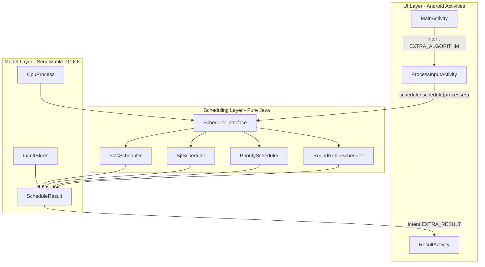

# CPU Scheduling Simulator — Architecture Analysis & Implementation Plan

## 1. Project Overview

This is a **Java-only Android app** (no Kotlin sources) with **3 Activities**, **3 model classes**, **1 scheduler interface**, and **4 scheduler implementations**. Scheduling logic is cleanly separated from Android UI — schedulers have **zero Android imports** and are covered by **JUnit unit tests**.

The app follows the PRD flow: **select algorithm → enter processes → calculate → view table + Gantt chart**.

---

## 2. Architecture




### Layer responsibilities


| Layer          | Package / Location                                                         | Role                                                                     |
| -------------- | -------------------------------------------------------------------------- | ------------------------------------------------------------------------ |
| **UI**         | `MainActivity`, `activity/ProcessInputActivity`, `activity/ResultActivity` | Navigation, input validation, dynamic row inflation, result rendering    |
| **Scheduling** | `scheduler/`                                                               | Pure Java algorithms implementing `Scheduler`                            |
| **Models**     | `model/`                                                                   | Data transfer between UI and schedulers via `Serializable` Intent extras |


### Core contract

Every algorithm implements one method:

```11:14:app/src/main/java/com/example/cpuschedulingsimulator/scheduler/Scheduler.java
public interface Scheduler {

    ScheduleResult schedule(List<CpuProcess> processes);
}
```

`CpuProcess` already supports preemptive scheduling via `remainingTime` (used by Round Robin):

```26:38:app/src/main/java/com/example/cpuschedulingsimulator/model/CpuProcess.java
    private int remainingTime;

    public CpuProcess(String processId, int arrivalTime, int burstTime, int priority) {
        // ...
        this.startTime = -1;
        this.remainingTime = burstTime;
    }
```

---

## 3. How Components Work Together

### Screen flow

```mermaid
sequenceDiagram
    participant User
    participant Main as MainActivity
    participant Input as ProcessInputActivity
    participant Sched as Scheduler
    participant Result as ResultActivity

    User->>Main: Tap algorithm card
    Main->>Input: startActivity(EXTRA_ALGORITHM)
    Input->>Input: Show/hide priority or quantum UI
    User->>Input: Enter processes, tap Calculate
    Input->>Input: readProcessesFromRows()
    Input->>Sched: new XxxScheduler(); schedule(processes)
    Sched-->>Input: ScheduleResult
    Input->>Result: startActivity(EXTRA_RESULT)
    Result->>Result: Build table + Gantt chart
    User->>Result: Tap Back
    Result->>Input: finish()
```


### Activity ↔ Layout mapping


| Activity                                                                                                               | Layout                                                                                                                                                          | Key UI elements                                                 |
| ---------------------------------------------------------------------------------------------------------------------- | --------------------------------------------------------------------------------------------------------------------------------------------------------------- | --------------------------------------------------------------- |
| `[MainActivity.java](app/src/main/java/com/example/cpuschedulingsimulator/MainActivity.java)`                          | `[activity_main.xml](app/src/main/res/layout/activity_main.xml)`                                                                                                | 4 `MaterialCardView` algorithm cards                            |
| `[ProcessInputActivity.java](app/src/main/java/com/example/cpuschedulingsimulator/activity/ProcessInputActivity.java)` | `[activity_process_input.xml](app/src/main/res/layout/activity_process_input.xml)` + `[item_process_input.xml](app/src/main/res/layout/item_process_input.xml)` | Process count, dynamic rows, optional quantum/priority          |
| `[ResultActivity.java](app/src/main/java/com/example/cpuschedulingsimulator/activity/ResultActivity.java)`             | `[activity_result.xml](app/src/main/res/layout/activity_result.xml)`                                                                                            | Averages, programmatic `TableLayout`, programmatic Gantt blocks |


### Algorithm wiring (central integration point)

`[ProcessInputActivity.calculateSchedule()](app/src/main/java/com/example/cpuschedulingsimulator/activity/ProcessInputActivity.java)` is where UI meets scheduling:

```218:246:app/src/main/java/com/example/cpuschedulingsimulator/activity/ProcessInputActivity.java
        switch (selectedAlgorithm) {

            case MainActivity.ALGORITHM_FCFS:
                scheduler = new FcfsScheduler();
                break;

            case MainActivity.ALGORITHM_SJF:
                scheduler = new SjfScheduler();
                break;

            case MainActivity.ALGORITHM_PRIORITY:
                scheduler = new PriorityScheduler();
                break;

            case MainActivity.ALGORITHM_ROUND_ROBIN:
                // reads timeQuantum, then:
                scheduler = new RoundRobinScheduler(timeQuantum);
                break;
```

Algorithm constants live on `MainActivity` and are passed via Intent string extras (`"FCFS"`, `"SJF"`, `"PRIORITY"`, `"ROUND_ROBIN"`).

### Result display

`[ResultActivity](app/src/main/java/com/example/cpuschedulingsimulator/activity/ResultActivity.java)`:

- Reads `ScheduleResult` from Intent (`Serializable`)
- Shows **Priority column** only when `ALGORITHM_PRIORITY` is selected
- Builds Gantt chart from `List<GanttBlock>` — already handles **multiple blocks per process** (Round Robin preemptive pattern)

No changes to result rendering are strictly required for preemptive SJF/Priority — they produce the same `ScheduleResult` shape.

---

## 4. Existing Algorithm Patterns

### Non-preemptive (FCFS, SJF, Priority)

- Event loop: pick one arrived process, run to completion, advance `currentTime`
- SJF and Priority share nearly identical selection loops (only tie-break differs)
- IDLE blocks when CPU waits for next arrival

### Preemptive (Round Robin)

- Uses `remainingTime`, ready queue (`ArrayDeque`), arrival index tracking
- Executes for `min(quantum, remainingTime)` per turn
- Adds arriving processes mid-execution
- Sets WT/TAT only on completion

**Key insight for new preemptive algorithms:** `[RoundRobinScheduler](app/src/main/java/com/example/cpuschedulingsimulator/scheduler/RoundRobinScheduler.java)` is the best reference implementation. SRTF and Preemptive Priority differ only in **how the next process is selected** — not in Gantt block construction or metric calculation.

---

## 5. Architectural Problems (Adding New Algorithms)

### Problems that will cause friction


| Issue                                      | Where                                                                                 | Impact on new algorithms                                                                       |
| ------------------------------------------ | ------------------------------------------------------------------------------------- | ---------------------------------------------------------------------------------------------- |
| **Manual switch wiring**                   | `ProcessInputActivity`, `MainActivity`, both Activities' `getReadableAlgorithmName()` | Each new algorithm requires edits in 3–4 places                                                |
| **Algorithm constants on MainActivity**    | `MainActivity.java`                                                                   | Root Activity becomes global config; no single registry                                        |
| **Duplicated helper methods**              | All 4 schedulers (`validateInput`, `copyProcesses`, `buildResult`)                    | ~25 lines × 4 copied; new schedulers will copy again unless extracted                          |
| **Duplicated display name logic**          | `ProcessInputActivity` + `ResultActivity`                                             | Same switch duplicated twice                                                                   |
| **UI visibility tied to string constants** | Priority field shown only for `ALGORITHM_PRIORITY`; quantum only for RR               | Preemptive Priority needs priority input; naming must distinguish non-preemptive vs preemptive |
| **Home screen card-per-algorithm**         | `activity_main.xml` grows linearly                                                    | 7+ algorithms = long scroll; acceptable for course project but not scalable                    |
| **No algorithm metadata**                  | Missing enum/config object                                                            | Cannot declaratively say "needs priority", "needs quantum", "show priority column"             |


### What is NOT a problem (good foundations)

- `Scheduler` interface is simple and sufficient
- Models already support preemptive scheduling (`remainingTime`, multi-block Gantt)
- Schedulers are Android-free and unit-testable
- `ResultActivity` already renders preemptive Gantt charts
- Existing test pattern in `app/src/test/.../scheduler/` is clear and reusable

### Recommended minimal prep (before implementing algorithms)

**Do NOT redesign architecture.** Make one small, beginner-friendly improvement when adding the first new algorithm:

1. **Extract shared scheduler helpers** into one class, e.g. `scheduler/SchedulerUtils.java` with `validateInput`, `copyProcesses`, `buildResult` — eliminates copy-paste without introducing complex inheritance.
2. **Add an `Algorithm` enum** (or simple config class) in a new file, e.g. `model/SchedulingAlgorithm.java`, holding: constant string, display name, whether priority/quantum inputs are needed, whether result table shows priority column. Replace duplicated switches with enum lookups.

These two changes are optional but strongly recommended — they reduce touch points from ~6 edits per algorithm to ~3.

---

## 6. Step-by-Step Implementation Plan

### Phase 0 — Prerequisites (recommended, ~1–2 hours)

Before writing SRTF:

1. Create `[scheduler/SchedulerUtils.java](app/src/main/java/com/example/cpuschedulingsimulator/scheduler/SchedulerUtils.java)` — move shared helpers from existing schedulers (refactor existing schedulers to call utils; behavior unchanged).
2. Create `[model/SchedulingAlgorithm.java](app/src/main/java/com/example/cpuschedulingsimulator/model/SchedulingAlgorithm.java)` enum with entries for all current + planned algorithms.
3. Replace duplicated `getReadableAlgorithmName()` switches in both Activities with `SchedulingAlgorithm.fromKey(...).getDisplayName()`.
4. Run existing unit tests to confirm no regressions.

**Risk:** Low. Pure refactor, no algorithm logic changes.

---

### Phase 1 — Preemptive SJF / SRTF (~3–5 hours)

**Algorithm:** Shortest Remaining Time First — at each decision point, run the arrived process with the smallest `remainingTime`. Preempt when a newly arrived process has shorter remaining time.

**Implementation approach (beginner-friendly, event-driven):**

1. Create `[scheduler/SrtfScheduler.java](app/src/main/java/com/example/cpuschedulingsimulator/scheduler/SrtfScheduler.java)` implementing `Scheduler`.
2. Structure (mirror Round Robin):
  - Copy processes, sort by arrival
  - Track `currentTime`, `nextArrivalIndex`, `completedCount`
  - Maintain list/set of **ready processes** (arrived, not completed)
  - Loop until all complete:
    - Add newly arrived processes
    - Handle IDLE if ready set empty
    - Select process with **minimum `remainingTime`** (tie-break: earlier arrival, then lower process ID)
    - Run for **1 time unit** OR until next arrival event (whichever comes first) — running 1 unit at a time is simplest and correct; optimize to jump to next event later if desired
    - Append/extend Gantt block (merge consecutive blocks for same process)
    - On completion: set WT, TAT, increment completed
3. Use `SchedulerUtils.buildResult(...)`.

**UI changes (minimal):**

- Add constant `ALGORITHM_SRTF = "SRTF"` in `[MainActivity.java](app/src/main/java/com/example/cpuschedulingsimulator/MainActivity.java)`
- Add card in `[activity_main.xml](app/src/main/res/layout/activity_main.xml)` — label: **"Preemptive SJF (SRTF)"** to distinguish from existing non-preemptive SJF card
- Add switch case in `ProcessInputActivity.calculateSchedule()`
- Add display name in enum / `getReadableAlgorithmName()`
- **No new input fields** — uses AT + BT only (same as non-preemptive SJF)

**Tests:**

- Create `[SrtfSchedulerTest.java](app/src/test/java/com/example/cpuschedulingsimulator/scheduler/SrtfSchedulerTest.java)` with:
  - Classic textbook example (preemption when shorter job arrives)
  - Idle CPU gap
  - Single process
  - Tie on remaining time (earlier arrival wins)
  - Invalid input (empty list)

**Rename consideration:** Existing SJF card could be relabeled **"SJF (Non-Preemptive)"** in XML only — no code rename of `SjfScheduler` required.

---

### Phase 2 — Preemptive Priority (~3–5 hours)

**Algorithm:** At each decision point, run the arrived process with the **highest priority** (lowest priority number, matching existing convention). Preempt when a higher-priority process arrives.

**Implementation approach:**

1. Create `[scheduler/PreemptivePriorityScheduler.java](app/src/main/java/com/example/cpuschedulingsimulator/scheduler/PreemptivePriorityScheduler.java)`.
2. Same event-driven loop as SRTF, but select by **minimum `priority` value** (tie-break: earlier arrival).
3. Reuse `remainingTime` tracking and Gantt block pattern from SRTF.

**UI changes:**

- Add `ALGORITHM_PREEMPTIVE_PRIORITY = "PREEMPTIVE_PRIORITY"`
- Add card in `activity_main.xml` — **"Preemptive Priority"**
- Show priority input field for this algorithm in `ProcessInputActivity.generateProcessRows()` (extend the existing `if ALGORITHM_PRIORITY` check to also include preemptive priority)
- Show priority column in `ResultActivity` for preemptive priority (extend `showPriority` check)
- Wire switch case in `calculateSchedule()`

**Tests:**

- Create `[PreemptivePrioritySchedulerTest.java](app/src/test/java/com/example/cpuschedulingsimulator/scheduler/PreemptivePrioritySchedulerTest.java)`:
  - Preemption on higher-priority arrival
  - Same priority → FCFS tie-break by arrival
  - Idle gap
  - Single process

---

### Phase 3 — Future Hybrid Scheduler (placeholder, ~6–12 hours depending on definition)

No hybrid algorithm is defined in the PRD or codebase. Plan a **generic extension point** now; finalize algorithm logic when requirements are decided.

**Likely candidates (pick one later):**


| Hybrid type                | Extra inputs needed                | Complexity         |
| -------------------------- | ---------------------------------- | ------------------ |
| Priority + Round Robin     | Time quantum                       | Medium             |
| MLFQ (multilevel feedback) | Number of queues, quanta per level | High               |
| SRTF + priority tie-break  | Priority field                     | Low (extends SRTF) |
| Aging priority             | Priority field + aging params      | Medium-High        |


**Recommended extension approach (minimal model changes):**

1. Create `[scheduler/HybridScheduler.java](app/src/main/java/com/example/cpuschedulingsimulator/scheduler/HybridScheduler.java)` with constructor accepting a **config object**:

```java
// Future file: model/HybridSchedulerConfig.java
public class HybridSchedulerConfig implements Serializable {
    private final int timeQuantum;
    private final int numberOfQueues;
    // add fields as algorithm is defined
}
```

1. If hybrid needs new inputs beyond AT/BT/priority/quantum, add a **collapsible config section** in `[activity_process_input.xml](app/src/main/res/layout/activity_process_input.xml)` (similar to existing `quantumContainer` pattern) — do not redesign the whole screen.
2. Register in enum, MainActivity card, ProcessInputActivity switch.

**Do not implement Phase 3 until hybrid rules are defined.**

---

## 7. Complete File Change List

### Phase 0 (optional refactor)


| Action     | File                                                                                                        |
| ---------- | ----------------------------------------------------------------------------------------------------------- |
| **Create** | `app/src/main/java/.../scheduler/SchedulerUtils.java`                                                       |
| **Create** | `app/src/main/java/.../model/SchedulingAlgorithm.java`                                                      |
| **Modify** | `FcfsScheduler.java`, `SjfScheduler.java`, `PriorityScheduler.java`, `RoundRobinScheduler.java` (use utils) |
| **Modify** | `ProcessInputActivity.java`, `ResultActivity.java` (use enum for names)                                     |


### Phase 1 — SRTF


| Action     | File                                                                 |
| ---------- | -------------------------------------------------------------------- |
| **Create** | `app/src/main/java/.../scheduler/SrtfScheduler.java`                 |
| **Create** | `app/src/test/java/.../scheduler/SrtfSchedulerTest.java`             |
| **Modify** | `MainActivity.java` — constant + click listener                      |
| **Modify** | `activity_main.xml` — new card; optionally relabel existing SJF card |
| **Modify** | `ProcessInputActivity.java` — switch case + display name             |
| **Modify** | `ResultActivity.java` — display name (if not using enum)             |
| **Modify** | `SchedulingAlgorithm.java` (if Phase 0 done)                         |


### Phase 2 — Preemptive Priority


| Action     | File                                                                   |
| ---------- | ---------------------------------------------------------------------- |
| **Create** | `app/src/main/java/.../scheduler/PreemptivePriorityScheduler.java`     |
| **Create** | `app/src/test/java/.../scheduler/PreemptivePrioritySchedulerTest.java` |
| **Modify** | `MainActivity.java`                                                    |
| **Modify** | `activity_main.xml`                                                    |
| **Modify** | `ProcessInputActivity.java` — switch, priority visibility              |
| **Modify** | `ResultActivity.java` — priority column visibility                     |
| **Modify** | `SchedulingAlgorithm.java` (if Phase 0 done)                           |


### Phase 3 — Hybrid (future)


| Action     | File                                                                                                                                          |
| ---------- | --------------------------------------------------------------------------------------------------------------------------------------------- |
| **Create** | `HybridScheduler.java`, `HybridSchedulerConfig.java`, `HybridSchedulerTest.java`                                                              |
| **Modify** | `MainActivity.java`, `activity_main.xml`, `activity_process_input.xml` (config container), `ProcessInputActivity.java`, `ResultActivity.java` |


### Files that should NOT change

- `[CpuProcess.java](app/src/main/java/com/example/cpuschedulingsimulator/model/CpuProcess.java)` — already has `remainingTime` and `priority`
- `[GanttBlock.java](app/src/main/java/com/example/cpuschedulingsimulator/model/GanttBlock.java)`
- `[ScheduleResult.java](app/src/main/java/com/example/cpuschedulingsimulator/model/ScheduleResult.java)`
- `[AndroidManifest.xml](app/src/main/AndroidManifest.xml)` — no new Activities needed
- `[app/build.gradle.kts](app/build.gradle.kts)` — no new dependencies needed
- `[item_process_input.xml](app/src/main/res/layout/item_process_input.xml)` — priority field already exists

---

## 8. Build Verification

### Configuration summary


| Setting      | Value                                                      |
| ------------ | ---------------------------------------------------------- |
| compileSdk   | API 36.1                                                   |
| minSdk       | 24                                                         |
| targetSdk    | 36                                                         |
| Java         | 11 (source/target compatibility)                           |
| Gradle       | 9.4.1                                                      |
| AGP          | 9.2.1                                                      |
| Dependencies | AppCompat, Material, ConstraintLayout, Activity-KTX, JUnit |


### Build result


| Check                                                  | Status                                                           |
| ------------------------------------------------------ | ---------------------------------------------------------------- |
| `assembleDebug` (with Android Studio JBR as JAVA_HOME) | **SUCCESS** — APK at `app/build/outputs/apk/debug/app-debug.apk` |
| `assembleDebug` (bare terminal, no JAVA_HOME)          | **FAILS** — `JAVA_HOME is not set`                               |
| Gradle sync / AGP compatibility                        | OK                                                               |
| AndroidManifest                                        | Valid — 3 activities, launcher exported                          |
| XML layouts                                            | No errors reported during build                                  |
| Missing dependencies                                   | None                                                             |
| Build warnings                                         | None observed on successful build                                |


### Build issues — action needed

**No code or Gradle fixes required.** The project builds successfully inside Android Studio and via CLI when Java is configured.

For **command-line builds outside Android Studio**, set:

```powershell
$env:JAVA_HOME = "C:\Program Files\Android\Android Studio\jbr"
```

Optional (not required for this project): add a note to README about JAVA_HOME for CLI usage.

---

## 9. Complexity & Risk Assessment


| Phase                           | Effort   | Difficulty | Risk                                                                            |
| ------------------------------- | -------- | ---------- | ------------------------------------------------------------------------------- |
| Phase 0 — Utils + enum refactor | 1–2 hrs  | Low        | Low — regression caught by existing 4 test classes                              |
| Phase 1 — SRTF                  | 3–5 hrs  | Medium     | **Medium** — preemption timing and Gantt block merging are the main bug sources |
| Phase 2 — Preemptive Priority   | 3–5 hrs  | Medium     | **Medium** — same as SRTF; can largely copy SRTF structure                      |
| Phase 3 — Hybrid                | 6–12 hrs | High       | **High** — undefined requirements; avoid until specified                        |


### Top technical risks

1. **Gantt block correctness** — preemptive algorithms produce many small blocks; must merge consecutive same-process blocks or render correctly as separate blocks (Round Robin already uses separate blocks — follow that pattern for consistency).
2. **Start time semantics** — `startTime` = first CPU use (`-1` until first run); verify on preemption/resume scenarios.
3. **Tie-breaking rules** — document and test: remaining time → arrival time → process ID order.
4. **Switch statement drift** — forgetting to update one of the 3–4 wiring points causes "Unknown algorithm" toast; enum reduces this risk.
5. **Home screen clutter** — 6+ cards is fine for a course project; consider grouping later if needed.

### Testing strategy

- Write unit tests **before** wiring UI (TDD-friendly for schedulers)
- Reuse patterns from `[RoundRobinSchedulerTest.java](app/src/test/java/com/example/cpuschedulingsimulator/scheduler/RoundRobinSchedulerTest.java)`: assert per-process ST/CT/TAT/WT, averages, and Gantt block sequence
- Manually verify 2–3 textbook examples in the app after UI wiring

---

## 10. Recommended Execution Order

```text
1. Confirm plan approval (no code yet)
2. Phase 0: SchedulerUtils + SchedulingAlgorithm enum (optional but recommended)
3. Phase 1: SrtfScheduler + unit tests → UI wiring → manual smoke test
4. Phase 2: PreemptivePriorityScheduler + unit tests → UI wiring → manual smoke test
5. Phase 3: Define hybrid rules → implement when ready
```

Each phase is independently shippable. Phases 1 and 2 do not require Phase 0, but Phase 0 makes Phases 1–2 cleaner.

---

## 11. What Will NOT Be Done (Per Your Constraints)

- No UI redesign (only new cards + optional labels)
- No ViewModel / Repository / Navigation Component introduction
- No database or persistence
- No changes to existing algorithm correctness
- No implementation until you approve this plan

